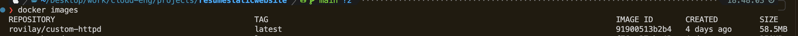

# Host Resume Amazon Elastic Kubernetes Service (EKS)

In this article, we will explore how to deploy and run a static website (your resume in this case) on  Amazon EKS.

## Technologies & Tools

* [AWS Account (Free Tier)](https://aws.amazon.com/free/?all-free-tier.sort-by=item.additionalFields.SortRank&all-free-tier.sort-order=asc&awsf.Free%20Tier%20Types=*all&awsf.Free%20Tier%20Categories=*all)

* [AWS CLI](https://docs.aws.amazon.com/eks/latest/userguide/install-awscli.html)

* [Docker Account](https://docs.github.com/en/repositories/creating-and-managing-repositories/creating-a-new-repository) - a version control for your code

* [Kubectl](https://kubernetes.io/docs/tasks/tools/)

* [Eksctl](https://eksctl.io/installation/#)

* [Github Repo](https://docs.github.com/en/repositories/creating-and-managing-repositories/creating-a-new-repository) - a version control for your code


# Pre-requsite

### [Optional] Github Account & Repo

Skip this if you don't intend to save your project on github. However, you can follow these links to setup a [Github Account](https://github.com/signup) & [Repo](https://docs.github.com/en/repositories/creating-and-managing-repositories/creating-a-new-repository).

### Setup AWS account and IAM User

Create you [AWS Free Tier account](https://aws.amazon.com/free/?all-free-tier.sort-by=item.additionalFields.SortRank&all-free-tier.sort-order=asc&awsf.Free%20Tier%20Types=*all&awsf.Free%20Tier%20Categories=*all) if you haven't. Then, follow these steps to create your [IAM user](https://docs.aws.amazon.com/IAM/latest/UserGuide/id_users_create.html#id_users_create_console). Ensure the IAM user is assigned the `AmazonS3FullAccess` policy.


### Setup AWS CLI

Skip this if you already have AWS CLI setup on your machine.

Follow this [AWS CLI](https://docs.aws.amazon.com/eks/latest/userguide/install-awscli.html) installation guide.

### Setup Docker 

We need docker to create our images and run containers (locally) we also need a docker account to save our images. [Sign up](https://app.docker.com/signup) to Docker and follow the [Docker setup guide](https://docs.docker.com/desktop/setup/install/mac-install/) to get docker installed on your machine.

### Setup Kubernetes CLI

Kubernetes provides a command line tool for communicating with a Kubernetes cluster's control plane, using the Kubernetes API. This tool is named kubectl. Follow this [installation guide](https://kubernetes.io/docs/tasks/tools/) to get started.


### Setup EKS CLI
Eksctl is a simple CLI tool for creating and managing clusters on EKS - Amazon's managed Kubernetes service for EC2. Follow this [installation guide](https://eksctl.io/installation/#) to get started.

⚠️ PLEASE NOTE: [Amazon EKS cost](https://aws.amazon.com/eks/pricing/) `10 cents` per hour, although relatively cheap I wanted to let you know before we get started. We will ensure to clean up once we are done with this tutorial in order not to incur any hidden cost.

Now let's get started! 😀

### Step 1

Create a folder for your project `EKS-Static-Resume-Website`
```
mkdir EKS-Static-Resume-Website
```

### Step 2
Change directory to `EKS-Static-Resume-Website` and create necessary files and folders
```
cd EKS-Static-Resume-Website
```

```
touch index.html Dockerfile loadbalancerservice.yaml style.css
```

### Step 3
Convert your resume to html (you can you GPT AI tools --- ChatGPT, Gemini, etc for that. Or copy my resume from my [github repo](https://github.com/rovilay/resumestaticwebsite/blob/main/index.html)) and then copy it into the `index.html` file, also copy the generated css into the `style.css` file.

### Step 4

Copy this [Dockerfile](https://github.com/rovilay/resumestaticwebsite/blob/main/Dockerfile) 👇🏿 into the `Dockerfile`. This is how we create the docker image for our resume website.
```
FROM httpd
COPY index.html /usr/local/apache2/htdocs/index.html
COPY style.css /usr/local/apache2/htdocs/style.css
```
**Explanation**

```
FROM httpd
```
We are building our image 👆🏿 from the [Apache HTTP server image](https://hub.docker.com/_/httpd)

```
COPY index.html /usr/local/apache2/htdocs/index.html
COPY style.css /usr/local/apache2/htdocs/style.css
```
We copy the `index.html` and `style.css` files into the `/usr/local/apache2/htdocs` folder respectively. The htdocs folder is our server root and where Apache will serve files from.

### Step 5
We are going to build our docker image. In your project root, run 

```
docker build --platform linux/amd64 -t {docker-account-username}/custom-httpd .
```
 
replace {docker-account-username} with your real docker account username, for me it's `rovilay`. The `-t` flag tags the built image with the name `rovilay/custom-httpd`. we specify the --platform `linux/amd64` to build images compatible with our ec2 instances.

Your image is still on your local machine. To confirm, run
```
docker images
```


#### Step 5.1

you can run your docker image locally just to confirm everything is fine.

```
docker run -d -p 8080:80 {docker-account-username}/custom-httpd 
```


To check if the container is running, run
```
docker ps
```


Navigate to localhost:8080 on your browser to see your resume

Now run 👇🏿 to stop the container
```
docker stop {container ID}
```

#### Step 5.2

We will push our image to docker hub. To do that run 
```
docker push rovilay/custom-httpd:latest
```

you can visit your [docker account](https://hub.docker.com/repository/docker/rovilay/custom-httpd/general) on docker hub to view the image.

### Step 6

Now we are going to setup our Kubernetes configuration a.k.a manifest file. Copy this [loadbalancerservice.yaml](https://github.com/rovilay/resumestaticwebsite/blob/main/loadbalancerservice.yaml) 👇🏿 in to the `loadbalancerservice.yaml`. Don't feel overwhelmed I will explain the code. 😅

```
apiVersion: v1
kind: Service
metadata:
  name: lb-service
  labels:
    app: lb-service
spec:
  type: LoadBalancer
  ports:
  - port: 80
  selector:
    app: frontend
---
apiVersion: apps/v1
kind: Deployment
metadata:
  name: frontend-deployment
spec:
  replicas: 2
  selector:
    matchLabels:
      app: frontend
  minReadySeconds: 30
  strategy:
    type: RollingUpdate
    rollingUpdate:
      maxSurge: 1
      maxUnavailable: 0
  template:
    metadata:
      labels:
        app: frontend
    spec:
      containers:
      - name: frontend-container
        image: rovilay/custom-httpd

```

**Explanation**
```
apiVersion: v1
kind: Service
metadata:
  name: lb-service
  labels:
    app: lb-service
spec:
  type: LoadBalancer
  ports:
  - port: 80
  selector:
    app: frontend
```

The first part 👆🏿 creates the loadbalancer service which is a kubernetes service that exposes the container (resume image) -- name `frontend` running  within our pod (more on this later). I won't bore you with the extra kubernetes details.

```
apiVersion: apps/v1
kind: Deployment
metadata:
  name: frontend-deployment
spec:
  replicas: 2
  selector:
    matchLabels:
      app: frontend
  minReadySeconds: 30
  strategy:
    type: RollingUpdate
    rollingUpdate:
      maxSurge: 1
      maxUnavailable: 0
  template:
    metadata:
      labels:
        app: frontend
    spec:
      containers:
      - name: frontend-container
        image: rovilay/custom-httpd
```

The `Deployment` manages our pods and in extention our containers; basically each pod runs one container (note: a pod can run multiple containers but usually and in this case we run a container per pod). The deployment ensures that our cluster is running the right amount of pod replicas (`replicas: 2`).

```
    spec:
      containers:
      - name: frontend-container
        image: rovilay/custom-httpd
```
This part 👆🏿 is where we referenced our docker image `rovilay/custom-httpd` that our container is running.

### Step 7

Create your kubernetes cluster on eks. To do this run,

```
eksctl create cluster --node-type t3.micro --nodes 4  --region us-east-1
```

I for one love the random names AWS comes up with 😅, however you can add the `--name {your-cluster-name}` flag if you want to name your cluster.

It takes a while for your cluster to be fully setup on EKS, so take some time, relax 🛀🏿 and sip a cup of coffee. ☕️

if your cluster runs successfully, you should see this 👇🏿 in your terminal.


Navigate to your EKS dashboard on AWS to see your cluster.


To view the EC2 instances provisioned in the cluster, run
```
kubectl get nodes
```


### Step 8

Deploy your container to the kubernetes cluster
```
kubectl apply -f loadbalancerservice.yaml
```

To confirm deployment, run
```
kubectl get all
```


### Step 8

Navigate to the load balancer url to view your host resume. Run,

```
kubectl get services
```

the url is in the `External-IP` column.

### Step 9

Clean up your cluster to avoid any unforseen cost. Run
```
kubectl delete deployment frontend-deployment

kubectl delete service lb-service 
```

Now delete the cluster on EKS, get the cluster name by running,
```
eksctl get cluster
```

and run,
```
eksctl delete cluster {cluster-name}
```


That's it guys!!! 🥳🎉🍾

We have successfully hosted a simple static web page on EKS. 

Follow for more content like this.

#AWS #EKS #k8s
